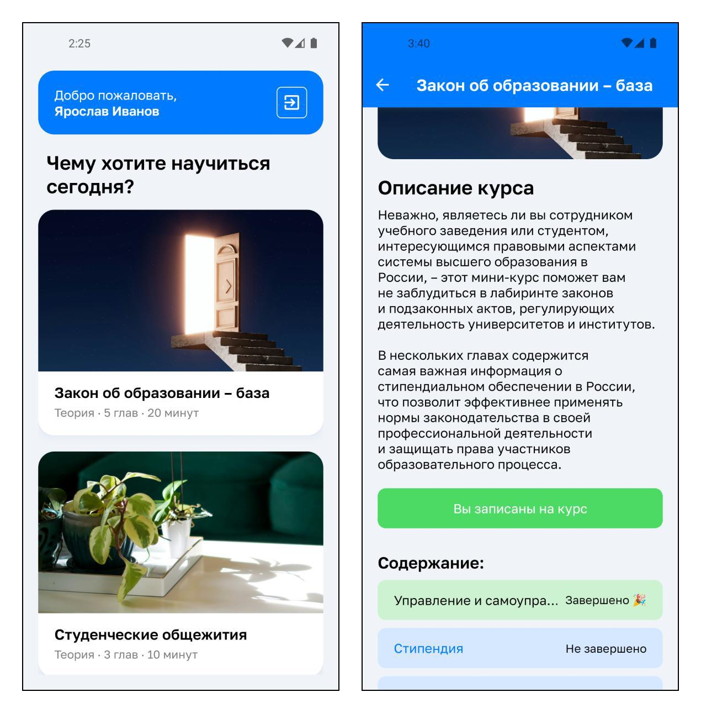
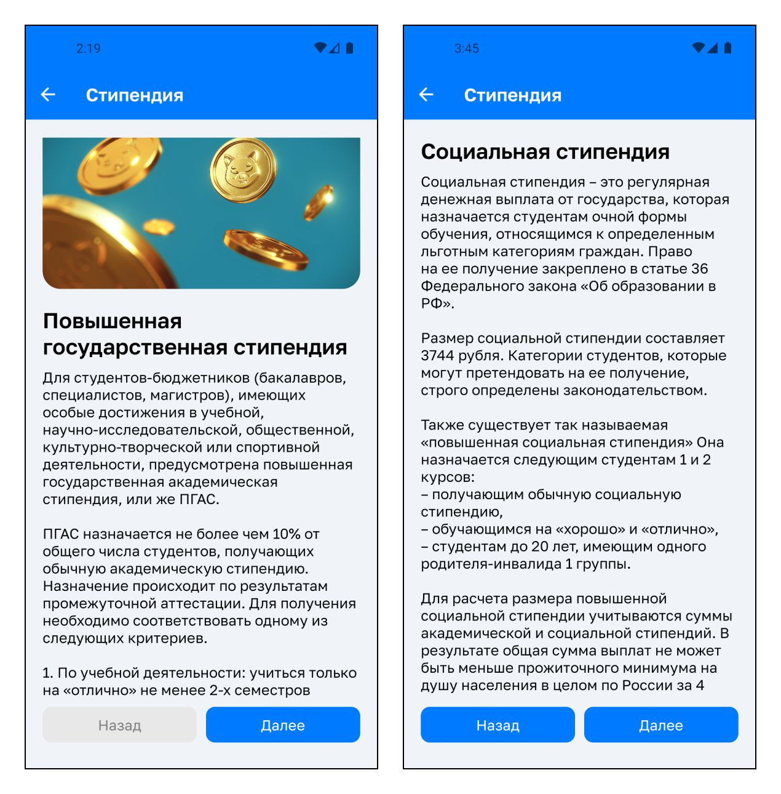
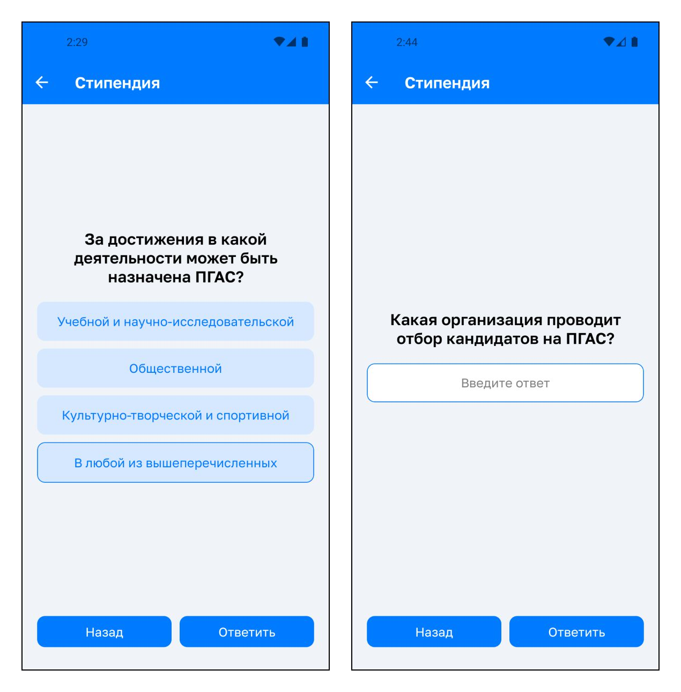

# Stipkom App

A cross-platform mobile application designed to train new members of university scholarship committees in Russia. It provides interactive learning experience about legal regulations and decision-making processes

## 👀 Screenshots

*Main navigation and course details with chapter breakdown*

*Theoretical content blocks with images*

*Interactive practice questions (multiple choice and text input)*

---

This project was developed as a [graduation thesis](https://sp.susu.ru/student/bachelorthesis/2024_404_ivanovya.pdf) at South Ural State University
